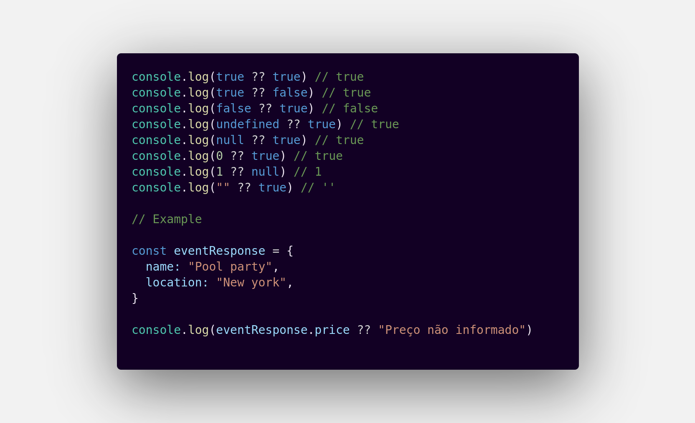
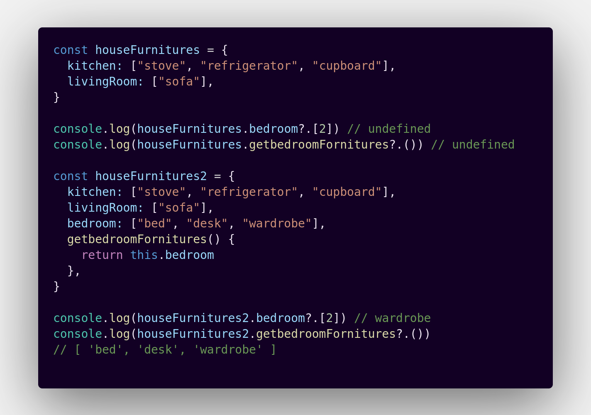
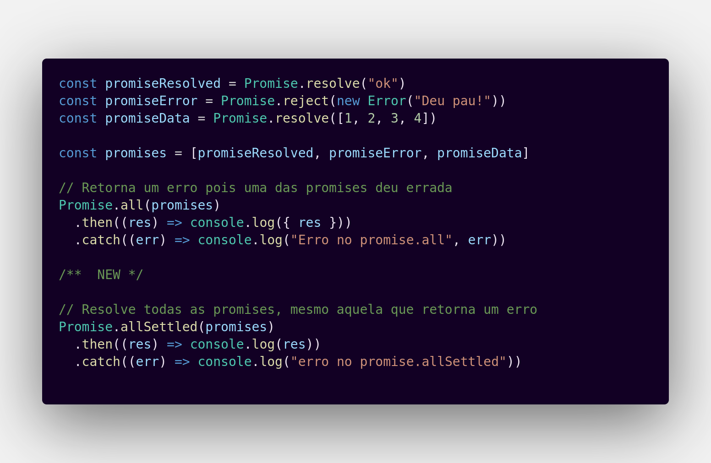

# ES2020 - New Features

## Dynamic importing

O Dynamic import permite que arquivos sejam carregados de froma assíncrona ou também sob demanda. o `import(modulo)` retorna uma promise com o módulo que está sendo importado.


## BigInt

> BigInt é um objeto nativo que fornece um modo de representar números inteiros maiores que 253, que é o maior número que o JavaScript consegue, com exatidão, representar com o tipo primitivo Number. [MDN](!https://developer.mozilla.org/pt-BR/docs/Web/JavaScript/Reference/Global_Objects/BigInt)

## globalThis

> A propriedade global globalThis retorna um objeto global de nível superior. [MDN](!https://developer.mozilla.org/pt-BR/docs/Web/.JavaScript/Reference/Global_Objects/globalThis)

Com essa propriedade garante-se possíbilidade de ter a referência do objeto global indeferentemente do contexto no qual ela estiver sendo executada.

```
function canIuse(method) {
  return typeof globalThis[method] === "function"
}

console.log(canIuse("XMLHttpRequest"))
// expected output (in a browser): true
```

## Nullish Coalescing

> O operador de coalescência nula (??) é um operador lógico que retorna o seu operando do lado direito quando o seu operando do lado esquerdo é `null` ou `undefined`. Caso Contrário, ele retorna o seu operando do lago esquerdo.
> [MDN](https://developer.mozilla.org/pt-BR/docs/Web/JavaScript/Reference/Operators/operador_de_coalescencia_nula)



## Optional Chaining

Com esse operador de encadeamento opcional `?` pode-se verificar uma propriedade dentro de uma cadeia de objetos sem a necessidade de testar cadeia uma a uma. Para isso, basta colocar `?.` (interroção seguida de ponto) que será possível testar se aquela propriedade de fato existe. Fazendo isso, no lugar de estourar um erro, será retornado `undefied`.



## Promise.allSettled

> O método `Promise.allSettled()`retorna uma promessa que é resolvida após todas as promessas dadas serem resolvidas ou rejeitadas, com um array de objetos que descrevem o resultado de cada promessa. [MDN](https://developer.mozilla.org/pt-BR/docs/Web/JavaScript/Reference/Global_Objects/Promise/allSettled)

Simplicando: o `Promise.allSettled()` resolverá todas as promises, não se importando se alguma delas for rejeitada.



## String.prototype.matchAll()

Em resumo, o `matchAll()` funciona de maneira semelhante ao `match()`, a diferença é que o novo método retorna um interador de todos os resultados da string passada pela regex, incluindo os [capturing groups](!https://developer.mozilla.org/en-US/docs/Web/JavaScript/Reference/Global_Objects/String/matchAll).


Percebe-se que para o `match` é retornado somente o resultado da expressa pesquisada, ou seja, a palavra name presseguida ou não de um inteiro. Isso gera o resultado que vemos na figura acima. Algo diferente é visto no `matchAll` que, além de retornar **name,name1...** retorna os groupos definido na expressão.

## Referências

- https://braziljs.org/artigos/o-que-ha-de-novo-no-es2020
- https://developer.mozilla.org/pt-BR/docs/Web/JavaScript/Reference/Operators/operador_de_coalescencia_nula
- https://developer.mozilla.org/pt-BR/docs/Web/JavaScript/Reference/Global_Objects/Promise/allSettled
- https://developer.mozilla.org/en-US/docs/Web/JavaScript/Guide/Regular_Expressions/Groups_and_Ranges
- https://developer.mozilla.org/pt-BR/docs/Web/JavaScript/Reference/Global_Objects/globalThis
- https://v8.dev/features/dynamic-import
